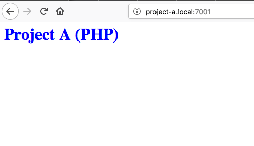
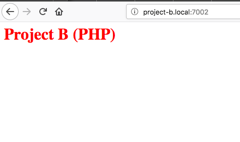
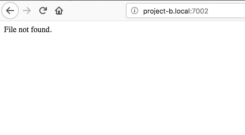
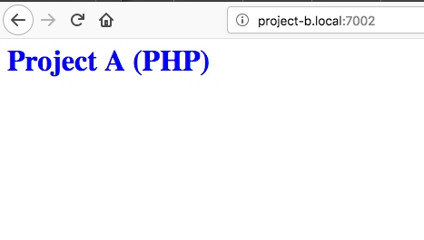

# Docker Volume Issue
Unpredictable and inconsistent volume content when using identically defined bind mounts in two distinct projects with distinct host directories.

This issue has been reproduced on both MacOS and Ubuntu running `docker-ce`.

#### MacOS High Sierra Versions
```
$ docker version
Client: Docker Engine - Community
 Version:           18.09.0
 API version:       1.39
 Go version:        go1.10.4
 Git commit:        4d60db4
 Built:             Wed Nov  7 00:47:43 2018
 OS/Arch:           darwin/amd64
 Experimental:      false

Server: Docker Engine - Community
 Engine:
  Version:          18.09.0
  API version:      1.39 (minimum version 1.12)
  Go version:       go1.10.4
  Git commit:       4d60db4
  Built:            Wed Nov  7 00:55:00 2018
  OS/Arch:          linux/amd64
  Experimental:     true

$ docker-compose --version
docker-compose version 1.23.1, build b02f1306
```
#### Ubuntu Versions (14.04.5 LTS (GNU/Linux 3.13.0-57-generic x86_64))
```
$  docker version
Client:
 Version:           18.06.1-ce
 API version:       1.38
 Go version:        go1.10.3
 Git commit:        e68fc7a
 Built:             Tue Aug 21 17:24:58 2018
 OS/Arch:           linux/amd64
 Experimental:      false

Server:
 Engine:
  Version:          18.06.1-ce
  API version:      1.38 (minimum version 1.12)
  Go version:       go1.10.3
  Git commit:       e68fc7a
  Built:            Tue Aug 21 17:23:24 2018
  OS/Arch:          linux/amd64
  Experimental:     false
  
$ docker-compose --version
docker-compose version 1.23.1, build b02f1306
```

## Reproduction

First, setup localhost alias entries in your `/etc/hosts` file like so:

```
127.0.0.1	project-a.local project-b.local
```

Next, clone this repo and create the project containers:

```
$ git clone https://github.com/dlgoodchild/docker-weird-volume-issue
$ cd docker-weird-volume-issue
$ cd project-a
$ docker-compose -p projecta up -d
$ cd ../project-b
$ docker-compose -p projectb up -d
```

## Results
Loading `http://project-a:7001`, provided it was the first container started, will result in the following, correct, results:  



Refreshing this page (`http://project-a:7001`) will result in **NO CHANGE**.

Loading, for the first time, `http://project-b:7002`, assuming it was the second container started, will result in:



Refresh:



Refresh again:



Continuing to refresh will result in these three results cycling/looping consistently.